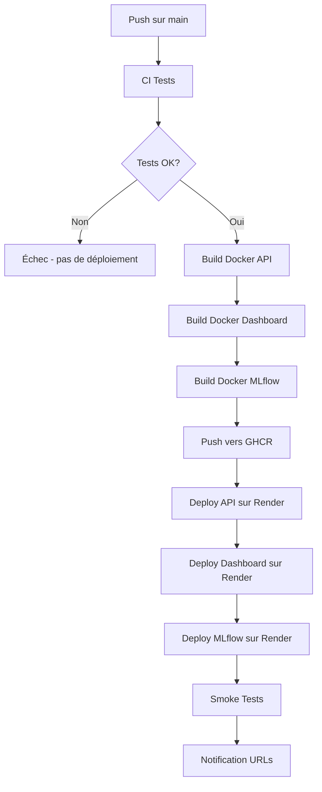

# Configuration MLOps - Déploiement complet

Ce guide explique comment configurer et déployer l'ensemble de la plateforme MLOps pour le projet Home Credit Scoring.

## 🏗️ Architecture

La plateforme MLOps se compose de 3 services déployés sur Render :

1. **API FastAPI** (scoring en temps réel)
2. **Dashboard Streamlit** (interface utilisateur)
3. **MLflow UI** (suivi des expérimentations)

## 📋 Prérequis

### 1. Compte Render

Créez un compte gratuit sur [Render.com](https://render.com)

### 2. Secrets GitHub

Ajoutez les secrets suivants dans votre repo GitHub (`Settings` > `Secrets and variables` > `Actions`) :

| Secret | Description | Comment l'obtenir |
|--------|-------------|-------------------|
| `RENDER_API_KEY` | Clé API Render | Dashboard Render > Account Settings > API Keys |
| `RENDER_SERVICE_API` | ID du service API | Voir section "Création des services" |
| `RENDER_SERVICE_DASHBOARD` | ID du service Dashboard | Voir section "Création des services" |
| `RENDER_MLFLOW_SERVICE_ID` | ID du service MLflow | Voir section "Création des services" |

## 🚀 Création des services Render

### Service 1 : API FastAPI

1. Aller sur [Render Dashboard](https://dashboard.render.com)
2. Cliquer sur **New +** > **Web Service**
3. Connecter votre repo GitHub
4. Configuration :
   - **Name**: `home-credit-api`
   - **Region**: `Frankfurt (EU Central)`
   - **Runtime**: `Docker`
   - **Dockerfile Path**: `./api/Dockerfile`
   - **Plan**: `Free`
   - **Environment Variables**:
     ```
     PORT=8000
     ```

5. Après création, copier le **Service ID** depuis l'URL :
   ```
   https://dashboard.render.com/web/srv-XXXXXXXXXXXX
                                       ^^^^^^^^^^^^^^
                                       Service ID
   ```
   
6. Ajouter ce Service ID comme secret GitHub `RENDER_SERVICE_API`

### Service 2 : Dashboard Streamlit

1. Créer un nouveau **Web Service**
2. Configuration :
   - **Name**: `home-credit-dashboard`
   - **Region**: `Frankfurt (EU Central)`
   - **Runtime**: `Docker`
   - **Dockerfile Path**: `./streamlit_app/Dockerfile`
   - **Plan**: `Free`
   - **Environment Variables**:
     ```
     API_URL=https://home-credit-api.onrender.com
     ```
     ⚠️ **Note**: L'URL sera automatiquement mise à jour par le workflow GitHub Actions

3. Copier le **Service ID** et l'ajouter comme secret `RENDER_SERVICE_DASHBOARD`

### Service 3 : MLflow UI

1. Créer un nouveau **Web Service**
2. Configuration :
   - **Name**: `home-credit-mlflow`
   - **Region**: `Frankfurt (EU Central)`
   - **Runtime**: `Docker`
   - **Dockerfile Path**: `./mlflow/Dockerfile`
   - **Plan**: `Free`
   - **Environment Variables**:
     ```
     PORT=5000
     ```

3. Copier le **Service ID** et l'ajouter comme secret `RENDER_MLFLOW_SERVICE_ID`

## 🔧 Configuration automatique

Une fois les secrets configurés, le workflow GitHub Actions (`deploy.yml`) :

1. ✅ Compile les 3 images Docker
2. ✅ Les pousse vers GitHub Container Registry (GHCR)
3. ✅ Déclenche le déploiement sur Render
4. ✅ Récupère automatiquement les URLs réelles des services
5. ✅ Passe l'URL de l'API au Dashboard via variable d'environnement
6. ✅ Affiche un résumé avec les 3 URLs de production

## 📊 Intégration Data Drift

Le rapport Evidently de data drift est intégré dans le Dashboard Streamlit :

1. Générer le rapport en exécutant le notebook `notebooks/04_Drift_Evidently.ipynb`
2. Le rapport HTML sera disponible dans `reports/evidently_full_report.html`
3. Le Dashboard affichera automatiquement le rapport dans l'onglet **📊 Data Drift**

## 🔍 Vérification du déploiement

Après un déploiement réussi, vérifiez :

### API Health
```bash
curl https://home-credit-api.onrender.com/health
```

Réponse attendue :
```json
{
  "status": "healthy",
  "model_loaded": true,
  "version": "1.0.0"
}
```

### Dashboard
Ouvrir dans un navigateur :
```
https://home-credit-dashboard.onrender.com
```

### MLflow UI
Ouvrir dans un navigateur :
```
https://home-credit-mlflow.onrender.com
```

## 🐛 Troubleshooting

### Problème : `model_loaded: false`

**Cause**: Les modèles ne sont pas inclus dans l'image Docker.

**Solution**:
1. Vérifier que `.gitignore` n'exclut pas `models/*.joblib`
2. Commit et push les modèles :
   ```bash
   git add models/lgbm_model.joblib models/preprocessor.joblib
   git commit -m "feat: include models for deployment"
   git push
   ```

### Problème : Dashboard ne peut pas contacter l'API

**Cause**: Variable d'environnement `API_URL` non définie.

**Solution**: Le workflow GitHub Actions passe automatiquement l'URL. Sinon, configurer manuellement sur Render :
```bash
Dashboard Settings > Environment > Add Environment Variable
API_URL = https://home-credit-api.onrender.com
```

### Problème : MLflow UI affiche une erreur 500

**Cause**: Dossier `mlruns/` vide ou manquant.

**Solution**: S'assurer que `mlruns/` est présent dans le repo avec au moins un run.

### Problème : Déploiement lent (> 5 minutes)

**Cause**: Cold start Render (plan gratuit).

**Solution**: C'est normal pour le plan gratuit. Les services s'arrêtent après 15 min d'inactivité.

## 🔄 Workflow de déploiement



## 📝 Variables d'environnement

### API (`api/Dockerfile`)
- `PORT`: Port d'écoute (défaut: 8000)

### Dashboard (`streamlit_app/Dockerfile`)
- `API_URL`: URL de l'API FastAPI (automatiquement définie par le workflow)

### MLflow (`mlflow/Dockerfile`)
- `PORT`: Port d'écoute (défaut: 5000)
- `MLFLOW_TRACKING_URI`: Chemin vers le backend store (défaut: `/app/mlruns`)

## 🎯 URLs finales

Après déploiement, les services seront disponibles aux URLs suivantes :

- **API**: `https://home-credit-api.onrender.com`
- **Dashboard**: `https://home-credit-dashboard.onrender.com`
- **MLflow**: `https://home-credit-mlflow.onrender.com`

Les URLs réelles sont affichées dans le résumé du workflow GitHub Actions.
