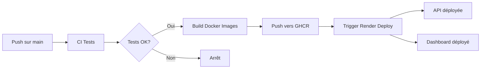

# Guide de Configuration Render pour Déploiement Automatique

Ce guide vous explique comment configurer Render pour le déploiement automatique de votre API et Dashboard.

## 📋 Prérequis

1. **Compte Render** : Créez un compte gratuit sur [render.com](https://render.com)
2. **Compte GitHub** : Votre repo doit être sur GitHub (déjà fait ✅)
3. **Images Docker** : Les images seront dans GitHub Container Registry (GHCR)

## 🚀 Étape 1 : Configuration API sur Render

### 1.1 Créer un nouveau Web Service

1. Connectez-vous à [dashboard.render.com](https://dashboard.render.com)
2. Cliquez sur **"New +"** → **"Web Service"**
3. Sélectionnez **"Deploy an existing image from a registry"**

### 1.2 Configurer l'image Docker

**Image URL** :
```
ghcr.io/absiinator/openclassrooms-ml-ops-api:latest
```

**Paramètres du service** :
- **Name** : `home-credit-api` (ou votre choix)
- **Region** : Europe (Frankfurt) ou proche de vous
- **Instance Type** : **Free** (pour commencer)

### 1.3 Variables d'environnement (optionnel pour l'API)

Ajoutez ces variables si nécessaire :
```bash
PORT=8000
HOST=0.0.0.0
```

### 1.4 Récupérer l'API Key pour le déploiement automatique

1. Allez dans **Account Settings** (icône utilisateur en haut à droite)
2. Cliquez sur **"API Keys"** dans le menu gauche
3. Cliquez sur **"Create API Key"**
4. Donnez un nom : `GitHub Actions Deploy`
5. **COPIEZ LA CLÉ** (vous ne la reverrez plus !)

### 1.5 Récupérer le Service ID

1. Ouvrez votre service API créé
2. Dans l'URL, copiez l'ID (exemple : `srv-xxxxxxxxxxxxx`)
   ```
   https://dashboard.render.com/web/srv-xxxxxxxxxxxxx
                                      ^^^^^^^^^^^^^^^^
   ```

## 🎨 Étape 2 : Configuration Dashboard sur Render

### 2.1 Créer un nouveau Web Service

Répétez les étapes 1.1 à 1.3 avec ces paramètres :

**Image URL** :
```
ghcr.io/absiinator/openclassrooms-ml-ops-dashboard:latest
```

**Paramètres du service** :
- **Name** : `home-credit-dashboard`
- **Region** : Europe (Frankfurt)
- **Instance Type** : **Free**

### 2.2 Variables d'environnement Dashboard

Ajoutez ces variables :
```bash
API_URL=https://home-credit-api.onrender.com
STREAMLIT_SERVER_PORT=8501
STREAMLIT_SERVER_ADDRESS=0.0.0.0
```

⚠️ **Important** : Remplacez `home-credit-api.onrender.com` par l'URL réelle de votre API.

### 2.3 Récupérer le Service ID Dashboard

Même procédure que 1.5, copiez le Service ID du Dashboard.

## 🔐 Étape 3 : Configuration GitHub Secrets

### 3.1 Ajouter les secrets dans GitHub

1. Allez sur votre repo GitHub
2. **Settings** → **Secrets and variables** → **Actions**
3. Cliquez sur **"New repository secret"**

**Secrets à ajouter** :

| Nom | Valeur | Description |
|-----|--------|-------------|
| `RENDER_API_KEY` | Votre clé API Render | Clé copiée à l'étape 1.4 |
| `RENDER_SERVICE_API` | `srv-xxxxxxxxxxxxx` | Service ID de l'API (étape 1.5) |
| `RENDER_SERVICE_DASHBOARD` | `srv-xxxxxxxxxxxxx` | Service ID du Dashboard (étape 2.3) |

### 3.2 Vérifier les secrets

Dans **Settings → Secrets → Actions**, vous devriez voir :
```
RENDER_API_KEY
RENDER_SERVICE_API
RENDER_SERVICE_DASHBOARD
```

## ✅ Étape 4 : Tester le Déploiement

### 4.1 Premier déploiement manuel sur Render

1. Retournez dans chaque service sur Render
2. Cliquez sur **"Manual Deploy"** → **"Deploy latest commit"**
3. Attendez que le build se termine (⏱️ ~5-10 minutes)

### 4.2 Vérifier que les services fonctionnent

**API** :
```bash
curl https://votre-api.onrender.com/health
```

Devrait retourner :
```json
{
  "status": "healthy",
  "model_loaded": true,
  "version": "1.0.0"
}
```

**Dashboard** :
Ouvrez `https://votre-dashboard.onrender.com` dans votre navigateur.

### 4.3 Tester le déploiement automatique

1. Faites un commit et push sur `main` :
   ```bash
   git add .
   git commit -m "test: trigger CD pipeline"
   git push origin main
   ```

2. Vérifiez dans **Actions** sur GitHub :
   - CI devrait passer ✅
   - CD devrait se déclencher automatiquement ✅
   - Les images Docker devraient être publiées ✅
   - Render devrait redéployer automatiquement ✅

## 🎯 URLs Finales

Une fois déployé, notez vos URLs :

```bash
# API
https://home-credit-api.onrender.com

# Dashboard
https://home-credit-dashboard.onrender.com

# Documentation API
https://home-credit-api.onrender.com/docs
```

## 📝 Notes Importantes

### ⚠️ Limitations du Plan Gratuit

- **Sleep après 15 min d'inactivité** : Premier appel prend ~30-60s
- **750h/mois** par service gratuit
- **Pas de custom domain** sur le plan gratuit

### 🔄 Workflow de Déploiement



### 🐛 Dépannage

**Problème : Le déploiement échoue**
- Vérifiez les logs dans Render Dashboard
- Vérifiez que les secrets GitHub sont corrects
- Vérifiez que les images sont publiques dans GHCR

**Problème : Dashboard ne peut pas joindre l'API**
- Vérifiez la variable `API_URL` dans le Dashboard
- Vérifiez que l'API est bien déployée et répond

**Problème : "Model not loaded"**
- Normal si les modèles ne sont pas inclus dans l'image
- Utilisez le fallback local dans Streamlit
- Ou configurez un stockage externe (S3, etc.)

## 🎓 Pour aller plus loin

### Option 1 : Stockage des modèles sur S3/GCS

```python
# Télécharger les modèles au démarrage
import boto3
s3 = boto3.client('s3')
s3.download_file('my-bucket', 'model.joblib', '/app/models/model.joblib')
```

### Option 2 : Utiliser Render Disks (Plan payant)

Permet de persister les fichiers entre déploiements.

### Option 3 : MLflow Model Registry

Charger le modèle depuis MLflow au démarrage de l'API.

---

## ✅ Checklist Finale

- [ ] Compte Render créé
- [ ] Web Service API créé
- [ ] Web Service Dashboard créé
- [ ] API Key Render générée
- [ ] Service IDs copiés
- [ ] Secrets GitHub configurés
- [ ] Premier déploiement manuel réussi
- [ ] API répond sur `/health`
- [ ] Dashboard accessible
- [ ] Déploiement automatique testé
- [ ] URLs finales documentées

**Félicitations ! Votre pipeline CI/CD est opérationnel ! 🎉**
