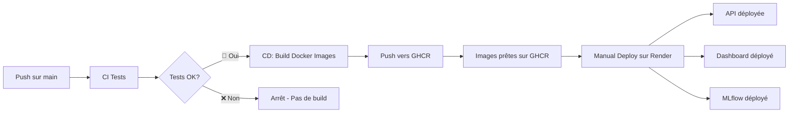

# Guide de Configuration Render pour Déploiement Automatique

Ce guide vous explique comment configurer Render pour le déploiement automatique de votre API et Dashboard.

## 📋 Prérequis

1. **Compte Render** : Créez un compte gratuit sur [render.com](https://render.com)
2. **Compte GitHub** : Votre repo doit être sur GitHub (déjà fait ✅)
3. **Images Docker** : Les images seront dans GitHub Container Registry (GHCR)

## � Architecture Docker

Le projet utilise 3 Dockerfiles distincts pour les 3 services :

### API (`api/Dockerfile`)
- **Base** : `python:3.10-slim`
- **Port** : 8000
- **Contenu** : 
  - Code source (`src/`, `api/`)
  - ✅ **Modèles pré-entraînés inclus** (`models/lgbm_model.joblib`, `preprocessor.joblib`, `model_config.json`)
  - ✅ **Données téléchargées automatiquement** depuis S3 OpenClassrooms lors du build
  - Dépendances Python pour FastAPI, LightGBM, SHAP
- **Téléchargement des données** : Le Dockerfile télécharge et décompresse automatiquement les données depuis :
  ```
  https://s3-eu-west-1.amazonaws.com/static.oc-static.com/.../home-credit-default-risk.zip
  ```
- **Variables d'env par défaut** :
  - `PORT=8000`
  - `PYTHONPATH=/app`
- **Health check** : `/health` (vérifie que les modèles sont chargés)
- **Commande** : `uvicorn api.main:app --host 0.0.0.0 --port $PORT`

### Dashboard (`streamlit_app/Dockerfile`)
- **Base** : `python:3.10-slim`
- **Port** : 8501
- **Contenu** : 
  - App Streamlit (`app.py`) avec 5 onglets (🎯 Scoring, 📊 Comparaison, 📁 Import/Simulation, 📈 Drift, 📖 Documentation)
  - Sources (`src/`)
  - Modèles (fallback local si API indisponible)
  - ✅ **Données téléchargées automatiquement** depuis S3 OpenClassrooms lors du build
  - **Barre latérale enrichie** :
    - 🔗 Navigation & Services (liens MLflow, API Docs)
    - 🏥 État des services (API, MLflow)
    - 🤖 Informations du modèle (seuil, version)
    - **📊 Statistiques descriptives du dataset** (nombre clients, taux de défaut, stats financières, démographiques, scores externes)
- **Téléchargement des données** : Le Dockerfile télécharge et décompresse automatiquement les données
- **Variables d'env par défaut** :
  - `PORT=8501`
  - `API_URL=http://localhost:8000`
  - `MLFLOW_URL=http://localhost:5002`
- **Health check** : `/_stcore/health`
- **Commande** : `streamlit run app.py --server.port=$PORT`

### MLflow (`mlflow/Dockerfile`)
- **Base** : `python:3.10-slim`
- **Port** : 5000
- **Contenu** : Répertoire `mlruns/` copié depuis le projet local lors du build
- **Variables d'env par défaut** :
  - `PORT=5000`
- **Commande** : `mlflow server --host 0.0.0.0 --port $PORT`

⚠️ **Notes importantes** : 
- Les **données sont téléchargées automatiquement** lors du build Docker depuis le bucket S3 OpenClassrooms (~500MB)
- Le build Docker prend environ 5-10 minutes supplémentaires pour le téléchargement
- **MLflow** : Les runs du dossier `mlruns/` local sont copiés dans l'image Docker lors du build GitHub Actions. Ils sont accessibles en lecture seule sur Render. Pour persister de nouvelles expériences en production, un backend S3 serait nécessaire (option payante non couverte).
### Résumé des variables d'environnement par service

| Service | Variable | Valeur par défaut | À configurer sur Render |
|---------|----------|-------------------|-------------------------|
| **API** | `PORT` | 8000 | Automatique (Render) |
| **API** | `HOST` | 0.0.0.0 | ✅ Optionnel |
| **Dashboard** | `PORT` | 8501 | Automatique (Render) |
| **Dashboard** | `API_URL` | http://localhost:8000 | ✅ **Obligatoire** : `https://votre-api.onrender.com` |
| **Dashboard** | `MLFLOW_URL` | http://localhost:5002 | ✅ **Obligatoire** : `https://votre-mlflow.onrender.com` |
| **MLflow** | `PORT` | 5000 | Automatique (Render) |
---

## �🚀 Étape 1 : Configuration API sur Render

### 1.1 Créer un nouveau Web Service

1. Connectez-vous à [dashboard.render.com](https://dashboard.render.com)
2. Cliquez sur **"New +"** → **"Web Service"**
3. Sélectionnez **"Deploy an existing image from a registry"**

### 1.2 Configurer l'image Docker

**Image URL** :
```
ghcr.io/absiinator/openclassrooms-ml-ops-api:latest
```

**Paramètres du service** :
- **Name** : `home-credit-api` (ou votre choix)
- **Region** : Europe (Frankfurt) ou proche de vous
- **Instance Type** : **Free** (pour commencer)

### 1.3 Variables d'environnement (optionnel pour l'API)

Ajoutez ces variables si nécessaire :
```bash
PORT=8000
HOST=0.0.0.0
```

### 1.4 Récupérer l'API Key pour le déploiement automatique

1. Allez dans **Account Settings** (icône utilisateur en haut à droite)
2. Cliquez sur **"API Keys"** dans le menu gauche
3. Cliquez sur **"Create API Key"**
4. Donnez un nom : `GitHub Actions Deploy`
5. **COPIEZ LA CLÉ** (vous ne la reverrez plus !)

### 1.5 Récupérer le Service ID

1. Ouvrez votre service API créé
2. Dans l'URL, copiez l'ID (exemple : `srv-xxxxxxxxxxxxx`)
   ```
   https://dashboard.render.com/web/srv-xxxxxxxxxxxxx
                                      ^^^^^^^^^^^^^^^^
   ```

## 🎨 Étape 2 : Configuration Dashboard sur Render

### 2.1 Créer un nouveau Web Service

Répétez les étapes 1.1 à 1.3 avec ces paramètres :

**Image URL** :
```
ghcr.io/absiinator/openclassrooms-ml-ops-dashboard:latest
```

**Paramètres du service** :
- **Name** : `home-credit-dashboard`
- **Region** : Europe (Frankfurt)
- **Instance Type** : **Free**

### 2.2 Variables d'environnement Dashboard

**Obligatoire** - Ajoutez ces variables :
```bash
API_URL=https://home-credit-api.onrender.com
MLFLOW_URL=https://home-credit-mlflow.onrender.com
```

**Optionnel** - Configuration Streamlit (déjà définies dans le Dockerfile) :
```bash
STREAMLIT_SERVER_PORT=8501
STREAMLIT_SERVER_ADDRESS=0.0.0.0
```

⚠️ **Important** : 
- Remplacez `home-credit-api.onrender.com` par l'URL réelle de votre API
- Vous ajouterez `MLFLOW_URL` après avoir créé le service MLflow (étape 2b)

### 2.3 Récupérer le Service ID Dashboard

Même procédure que 1.5, copiez le Service ID du Dashboard.

## � Étape 2b : Configuration MLflow sur Render

### 2b.1 Créer un service MLflow

MLflow permet de tracker les expériences et stocker les modèles.

1. Cliquez sur **"New +"** → **"Web Service"**
2. Sélectionnez **"Deploy an existing image from a registry"**

**Image URL** :

```
ghcr.io/absiinator/openclassrooms-ml-ops-mlflow:latest
```

ℹ️ Le Dockerfile MLflow (`mlflow/Dockerfile`) est déjà configuré et l'image sera automatiquement construite par GitHub Actions.

### 2b.2 Paramètres du service MLflow

| Paramètre | Valeur |
|-----------|--------|
| **Name** | `home-credit-mlflow` |
| **Region** | Europe (Frankfurt) |
| **Instance Type** | Free (512MB RAM) |
| **Port** | 5000 (ou `$PORT`) |

⚠️ **Important - Optimisations appliquées** :
- Le Dockerfile est configuré avec **1 worker** au lieu de 4 par défaut
- Timeout augmenté à **120 secondes** pour éviter les crashs
- Dépendances minimales (pas de boto3/psycopg2) pour économiser la RAM
- Si vous voyez des erreurs "WORKER TIMEOUT" au démarrage, c'est normal - attendez 1-2 minutes que le service se stabilise

### 2b.3 Récupérer le Service ID MLflow

Même procédure que pour l'API et le Dashboard.

### 2b.4 Ajouter MLFLOW_URL au Dashboard

**Important** : Retournez au service Dashboard créé à l'étape 2 et ajoutez cette variable d'environnement :

```bash
MLFLOW_URL=https://home-credit-mlflow.onrender.com
```

⚠️ Remplacez par l'URL réelle de votre service MLflow sur Render.

## 🔐 Étape 3 : Configuration GitHub (Optionnel)

### 3.1 Workflow CI/CD Simplifié

Le workflow GitHub Actions actuel :
1. **CI** : Exécute les tests sur chaque push
2. **CD** : Si tests OK → Build les 3 images Docker → Push vers GHCR
3. **Déploiement** : **MANUEL** sur Render (cliquez "Manual Deploy")

⚠️ **Note importante** :
- **En local** (avec `python run.py ...`), aucune variable secrète n'est requise.
- **Sur Render ou tout environnement distant**, les secrets GitHub sont **OBLIGATOIRES** pour que le déploiement fonctionne correctement (API, Dashboard, MLflow).

### 3.2 Secrets GitHub (**Obligatoires pour Render**)

Pour tout déploiement sur Render (ou tout environnement non local), ajoutez ces secrets dans GitHub :

1. Allez sur votre repo GitHub
2. **Settings** → **Secrets and variables** → **Actions**
3. Cliquez sur **"New repository secret"**

**Secrets à ajouter (OBLIGATOIRES pour Render)** :

| Nom | Valeur | Description | Nécessaire ? |
|-----|--------|-------------|-------------|
| `RENDER_API_KEY` | Votre clé API Render | Clé copiée à l'étape 1.4 | ✅ Oui (déploiement Render) |
| `RENDER_SERVICE_API` | `srv-xxxxxxxxxxxxx` | Service ID de l'API (étape 1.5) | ✅ Oui (déploiement Render) |
| `RENDER_SERVICE_DASHBOARD` | `srv-xxxxxxxxxxxxx` | Service ID du Dashboard (étape 2.3) | ✅ Oui (déploiement Render) |
| `RENDER_SERVICE_MLFLOW` | `srv-xxxxxxxxxxxxx` | Service ID de MLflow (étape 2b.3) | ✅ Oui (déploiement Render) |

> 💡 **Astuce** : Les secrets sont uniquement optionnels si vous testez tout en local avec `run.py`. Pour tout déploiement sur Render, ils sont impératifs.

## ✅ Étape 4 : Déploiement et Test

### 4.1 Déploiement manuel sur Render

**🔴 Important** : Avec le tier gratuit, le déploiement est MANUEL.

**Première fois** :
1. Retournez dans chaque service sur Render (API, Dashboard, MLflow)
2. Cliquez sur **"Manual Deploy"** → **"Deploy latest commit"**
3. Attendez que le build se termine (⏱️ ~5-10 minutes)

**Mises à jour ultérieures** :
1. Poussez votre code sur `main`
2. Attendez que le workflow GitHub Actions build les nouvelles images (⏱️ ~10-15 min)
3. Les images sont automatiquement poussées vers GHCR
4. **Sur Render, cliquez "Manual Deploy"** pour déployer les nouvelles images
5. Render va pull les images depuis GHCR et redéployer les services

### 4.2 Vérifier que les services fonctionnent

**API** :
```bash
curl https://votre-api.onrender.com/health
```

Devrait retourner :
```json
{
  "status": "healthy",
  "model_loaded": true,
  "version": "1.0.0"
}
```

**Dashboard** :
Ouvrez `https://votre-dashboard.onrender.com` dans votre navigateur.

### 4.3 Workflow de déploiement automatisé

1. Faites un commit et push sur `main` :
   ```bash
   git add .
   git commit -m "feat: add new feature"
   git push origin main
   ```

2. Vérifiez dans **Actions** sur GitHub :
   - ✅ CI devrait passer (tests)
   - ✅ CD devrait se déclencher automatiquement (build images)
   - ✅ Les images Docker devraient être publiées sur GHCR

3. **Sur Render Dashboard** :
   - Ouvrez chaque service (API, Dashboard, MLflow)
   - Cliquez sur **"Manual Deploy"** → **"Clear build cache & deploy"**
   - Attendez le redéploiement (~5-10 min)

> 💡 **Astuce** : Render pull automatiquement la dernière image `latest` depuis GHCR lors du manual deploy.

## 🎯 URLs Finales

Une fois déployé, notez vos URLs :

```bash
# API
https://home-credit-api.onrender.com

# Dashboard
https://home-credit-dashboard.onrender.com

# MLflow UI
https://home-credit-mlflow.onrender.com

# Documentation API
https://home-credit-api.onrender.com/docs
```

## 🔗 Variables d'environnement GitHub

Pour que les URLs soient disponibles comme variables d'environnement dans les workflows CI/CD, ajoutez-les comme **variables** (pas secrets) dans GitHub :

1. Allez dans **Settings** → **Secrets and variables** → **Actions**
2. Cliquez sur l'onglet **"Variables"**
3. Ajoutez les variables suivantes :

| Nom | Valeur |
|-----|--------|
| `RENDER_API_URL` | `https://home-credit-api.onrender.com` |
| `RENDER_DASHBOARD_URL` | `https://home-credit-dashboard.onrender.com` |
| `RENDER_MLFLOW_URL` | `https://home-credit-mlflow.onrender.com` |

Ces variables peuvent ensuite être utilisées dans les workflows avec `${{ vars.RENDER_API_URL }}`.

## 📝 Notes Importantes

### ⚠️ Limitations du Plan Gratuit

- **Sleep après 15 min d'inactivité** : Premier appel prend ~30-60s
- **750h/mois** par service gratuit
- **Pas de custom domain** sur le plan gratuit

### 🔄 Workflow de Déploiement



**Étapes** :
1. 💾 Push code sur `main`
2. 🧪 CI exécute les tests
3. ✅ Si tests OK → CD build les 3 images Docker (API, Dashboard, MLflow)
4. 📦 Images poussées vers GHCR (GitHub Container Registry)
5. 👤 **Vous cliquez "Manual Deploy" sur Render** pour chaque service
6. 🚀 Render pull les images depuis GHCR et déploie

### 🐛 Dépannage

**Problème : Le déploiement échoue**
- Vérifiez les logs dans Render Dashboard
- Vérifiez que les secrets GitHub sont corrects
- Vérifiez que les images sont publiques dans GHCR

**Problème : Dashboard ne peut pas joindre l'API**
- Vérifiez la variable `API_URL` dans le Dashboard
- Vérifiez que l'API est bien déployée et répond

**Problème : "Model not loaded"**
- Normal si les modèles ne sont pas inclus dans l'image Docker
- Le Dashboard utilise automatiquement le fallback local si l'API ne répond pas

**Problème : MLflow - "WORKER TIMEOUT" ou "Out of memory"**
- **Normal au premier démarrage** - Attendez 1-2 minutes que le service se stabilise
- Le tier gratuit a 512MB RAM - MLflow est configuré avec 1 worker pour économiser la mémoire
- Si les erreurs persistent après 2 minutes, le service devrait fonctionner normalement
- Les workers qui crashent sont automatiquement redémarrés par Gunicorn

---

## ✅ Checklist Finale

- [ ] Compte Render créé
- [ ] Web Service API créé (Image: `ghcr.io/username/openclassrooms-ml-ops-api:latest`)
- [ ] Web Service Dashboard créé (Image: `ghcr.io/username/openclassrooms-ml-ops-dashboard:latest`)
- [ ] Web Service MLflow créé (Image: `ghcr.io/username/openclassrooms-ml-ops-mlflow:latest`)
- [ ] Variables d'env configurées sur chaque service Render (`API_URL`, `MLFLOW_URL` pour Dashboard)
- [ ] (Optionnel) API Key Render générée et Service IDs copiés
- [ ] (Optionnel) Secrets GitHub configurés (si déploiement automatique souhaité - non actif actuellement)
- [ ] (Optionnel) Variables GitHub configurées (URLs de déploiement)
- [ ] Premier déploiement manuel réussi (clic "Manual Deploy")
- [ ] API répond sur `/health` (modèles chargés)
- [ ] Dashboard accessible avec statistiques descriptives dans la sidebar
- [ ] MLflow UI accessible
- [ ] Workflow CI/CD testé (push → tests → build images → GHCR)
- [ ] Processus de déploiement manuel testé
- [ ] URLs finales documentées

**Félicitations ! Votre pipeline CI/CD avec déploiement manuel sur Render est opérationnel ! 🎉**

---

## 🔍 Récapitulatif des Changements Récents

### ✅ Modèles inclus dans l'API
- Les modèles (`lgbm_model.joblib`, `preprocessor.joblib`, `model_config.json`) sont **inclus dans l'image Docker** de l'API
- L'API les charge automatiquement au démarrage depuis `/app/models/`
- Le health check `/health` vérifie que les modèles sont correctement chargés

### 📊 Sidebar du Dashboard enrichie
La barre latérale contient maintenant **4 sections** :
1. **🔗 Navigation & Services** : Liens vers MLflow et API Docs
2. **🏥 État des Services** : Statut en temps réel de l'API et MLflow
3. **🤖 Modèle ML** : Seuil optimal et détails techniques
4. **📊 Statistiques Dataset** (NOUVEAU) :
   - Métriques générales (nombre clients, variables, taux de défaut)
   - Statistiques financières (revenu, crédit)
   - Statistiques démographiques (âge, genre, enfants)
   - Scores externes (EXT_SOURCE_1, 2, 3)

### 🔄 Workflow CD Simplifié
- **Avant** : CI/CD avec déploiement automatique via API Render (nécessitait secrets)
- **Maintenant** : 
  - CI exécute les tests
  - CD build les images Docker et les push vers GHCR
  - **Déploiement MANUEL** sur Render (clic "Manual Deploy")
- **Avantages** : Plus simple, pas de secrets à configurer, compatible avec tier gratuit Render
