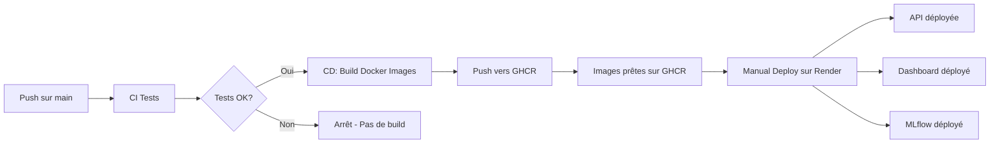

# Guide de Configuration Render pour Déploiement Automatique

Ce guide vous explique comment configurer Render pour le déploiement automatique de votre API et Dashboard.

## 📋 Prérequis

1. **Compte Render** : Créez un compte gratuit sur [render.com](https://render.com)
2. **Compte GitHub** : Votre repo doit être sur GitHub (déjà fait ✅)
3. **Images Docker** : Les images seront dans GitHub Container Registry (GHCR)

## � Architecture Docker

Le projet utilise 3 Dockerfiles distincts pour les 3 services :

### API (`api/Dockerfile`)
- **Base** : `python:3.10-slim`
- **Port** : 8000
- **Contenu** : 
  - Code source (`src/`, `api/`)
  - ✅ **Modèles pré-entraînés inclus** (`models/lgbm_model.joblib`, `preprocessor.joblib`, `model_config.json`)
  - ✅ **Données téléchargées automatiquement** depuis S3 OpenClassrooms lors du build
  - Dépendances Python pour FastAPI, LightGBM, SHAP
- **Téléchargement des données** : Le Dockerfile télécharge et décompresse automatiquement les données depuis :
  ```
  https://s3-eu-west-1.amazonaws.com/static.oc-static.com/.../home-credit-default-risk.zip
  ```
- **Variables d'env par défaut** :
  - `PORT=8000`
  - `PYTHONPATH=/app`
- **Health check** : `/health` (vérifie que les modèles sont chargés)
- **Commande** : `uvicorn api.main:app --host 0.0.0.0 --port $PORT`

### Dashboard (`streamlit_app/Dockerfile`)
- **Base** : `python:3.10-slim`
- **Port** : 8501
- **Contenu** : 
  - App Streamlit (`app.py`) avec 5 onglets (🎯 Scoring, 📊 Comparaison, 📁 Import/Simulation, 📈 Drift, 📖 Documentation)
  - Sources (`src/`)
  - ✅ **Données téléchargées automatiquement** depuis S3 OpenClassrooms lors du build
  - **Barre latérale enrichie** :
    - 🔗 Navigation & Services (liens MLflow, API Docs)
    - 🏥 État des services (API, MLflow)
    - 🤖 Informations du modèle (seuil, version)
    - **📊 Statistiques descriptives du dataset** (nombre clients, taux de défaut, stats financières, démographiques, scores externes)
- **Téléchargement des données** : Le Dockerfile télécharge et décompresse automatiquement les données
- **Variables d'env par défaut** :
  - `PORT=8501`
  - `API_URL=http://localhost:8000`
  - `MLFLOW_URL=http://localhost:5000`
- **Health check** : `/_stcore/health`
- **Commande** : `streamlit run app.py --server.port=$PORT`

### MLflow (`mlflow/Dockerfile`)
- **Base** : `python:3.10-slim`
- **Port** : 5000
- **Contenu** : Répertoire `mlruns/` copié depuis le projet local lors du build
- **Variables d'env par défaut** :
  - `PORT=5000`
- **Commande** : `mlflow server --host 0.0.0.0 --port $PORT`

⚠️ **Notes importantes** : 
- Les **données sont téléchargées automatiquement** lors du build Docker depuis le bucket S3 OpenClassrooms (~500MB)
- Le build Docker prend environ 5-10 minutes supplémentaires pour le téléchargement
- **MLflow** : Les runs du dossier `mlruns/` local sont copiés dans l'image Docker lors du build GitHub Actions. Ils sont accessibles en lecture seule sur Render. Pour persister de nouvelles expériences en production, un backend S3 serait nécessaire (option payante non couverte).

### Résumé des variables d'environnement par service

| Service | Variable | Valeur par défaut (Dockerfile) | Configurer sur Render ? |
|---------|----------|-------------------------------|------------------------|
| **API** | `HOST` | 0.0.0.0 | ❌ Non (défini dans Dockerfile) |
| **API** | `PORT` | 8000 | ❌ Non (Render le définit automatiquement) |
| **Dashboard** | `API_URL` | http://localhost:8000 | ✅ **OUI - OBLIGATOIRE** : `https://votre-api.onrender.com` |
| **Dashboard** | `MLFLOW_URL` | http://localhost:5000 | ✅ **OUI - OBLIGATOIRE** : `https://votre-mlflow.onrender.com` |
| **Dashboard** | `STREAMLIT_SERVER_ADDRESS` | 0.0.0.0 | ❌ Non (défini dans Dockerfile) |
| **Dashboard** | `STREAMLIT_SERVER_PORT` | 8501 | ❌ Non (défini dans Dockerfile) |
| **Dashboard** | `PORT` | 8501 | ❌ Non (Render le définit automatiquement) |
| **MLflow** | `PORT` | 5000 | ❌ Non (Render le définit automatiquement) |

> 💡 **Important** : Seules `API_URL` et `MLFLOW_URL` du Dashboard nécessitent une configuration manuelle sur Render.

### Secrets GitHub Actions (dans le repo distant)

| Secret | Description |
|--------|-------------|
| `RENDER_API_KEY` | Clé API Render (non utilisée actuellement - déploiement manuel) |
| `RENDER_SERVICE_API` | ID du service API sur Render |
| `RENDER_SERVICE_DASHBOARD` | ID du service Dashboard sur Render |
| `RENDER_SERVICE_MLFLOW` | ID du service MLflow sur Render |

> ⚠️ Ces secrets ne sont **pas utilisés** dans le workflow actuel (déploiement manuel). Ils sont prévus pour un futur déploiement automatique.

---

## �🚀 Étape 1 : Configuration API sur Render

### 1.1 Créer un nouveau Web Service

1. Connectez-vous à [dashboard.render.com](https://dashboard.render.com)
2. Cliquez sur **"New +"** → **"Web Service"**
3. Sélectionnez **"Deploy an existing image from a registry"**

### 1.2 Configurer l'image Docker

**Image URL** :
```
ghcr.io/absiinator/openclassrooms-ml-ops-api:latest
```

**Paramètres du service** :
- **Name** : `home-credit-api` (ou votre choix)
- **Region** : Europe (Frankfurt) ou proche de vous
- **Instance Type** : **Free** (pour commencer)

### 1.4 Variables d'environnement (optionnel pour l'API)

Ajoutez ces variables si nécessaire :
```bash
PORT=8000
HOST=0.0.0.0
```

> ⚠️ **Note** : Sur Render, `PORT` est défini automatiquement. Vous n'avez généralement pas besoin de le configurer manuellement.

## 🎨 Étape 2 : Configuration Dashboard sur Render

### 2.1 Créer un nouveau Web Service

Répétez les étapes 1.1 et 1.2 avec ces paramètres :

**Image URL** :
```
ghcr.io/absiinator/openclassrooms-ml-ops-dashboard:latest
```

**Paramètres du service** :
- **Name** : `home-credit-dashboard`
- **Region** : Europe (Frankfurt)
- **Instance Type** : **Free**

### 2.2 Variables d'environnement Dashboard

**🚨 OBLIGATOIRE** - Ajoutez ces variables dans Render (onglet "Environment") :
```bash
API_URL=https://home-credit-api.onrender.com
MLFLOW_URL=https://home-credit-mlflow.onrender.com
```

> ⚠️ **ATTENTION - Configuration Critique** : 
> 1. **Ces variables DOIVENT être configurées dans Render Web Service → Environment**
> 2. Remplacez `home-credit-api.onrender.com` par l'URL **réelle** de votre service API Render
> 3. Remplacez `home-credit-mlflow.onrender.com` par l'URL **réelle** de votre service MLflow Render
> 4. **Format correct** : `https://` + nom-du-service + `.onrender.com`
> 5. **Ne pas utiliser les valeurs par défaut** `localhost:8000` et `localhost:5000` (ne fonctionnent pas en production)
> 6. **Redémarrer le service Dashboard** après avoir ajouté les variables
> 
> 💡 **Comment trouver vos URLs** :
> - API URL : Dashboard Render → service API → copier "Live URL" (ex: `https://home-credit-api.onrender.com`)
> - MLflow URL : Dashboard Render → service MLflow → copier "Live URL" (ex: `https://home-credit-mlflow.onrender.com`)
> 
> 🐛 **Debug** : Dans le Dashboard, cliquez sur "🔍 URLs configurées" dans la sidebar pour vérifier les URLs actives

## � Étape 2b : Configuration MLflow sur Render

### 2b.1 Créer un service MLflow

MLflow permet de tracker les expériences et stocker les modèles.

1. Cliquez sur **"New +"** → **"Web Service"**
2. Sélectionnez **"Deploy an existing image from a registry"**

**Image URL** :

```
ghcr.io/absiinator/openclassrooms-ml-ops-mlflow:latest
```

ℹ️ Le Dockerfile MLflow (`mlflow/Dockerfile`) est déjà configuré et l'image sera automatiquement construite par GitHub Actions.

### 2b.2 Paramètres du service MLflow

| Paramètre | Valeur |
|-----------|--------|
| **Name** | `home-credit-mlflow` |
| **Region** | Europe (Frankfurt) |
| **Instance Type** | Free (512MB RAM) |
| **Port** | 5000 (ou `$PORT`) |

⚠️ **Important - Optimisations pour Free Tier** :
- Le Dockerfile utilise **`mlflow ui`** au lieu de `mlflow server` (pas de gunicorn = moins de RAM)
- `mlflow ui` utilise Flask intégré - **parfait pour 512MB RAM du tier gratuit**
- Les chemins `artifact_location` et `artifact_uri` sont automatiquement corrigés pour Docker
- Dépendances minimales pour économiser la RAM
- Le premier démarrage peut prendre 30-60 secondes

💡 **Si MLflow crash avec "Out of Memory"** :
1. Vérifier les logs Render : `Worker was sent SIGKILL! Perhaps out of memory?`
2. Solutions : 
   - ✅ Upgrade vers un plan payant (512MB → 2GB RAM)
   - ⚠️ Redémarrer le service (solution temporaire)
   - 🔄 Alternative : utiliser un stockage S3 au lieu du système de fichiers local

### 2b.3 Variables d'environnement MLflow

Sur Render, aucune variable n'est nécessaire - `PORT` est défini automatiquement.

### 2b.4 Ajouter MLFLOW_URL au Dashboard

**✅ IMPORTANT** : Retournez au service Dashboard créé à l'étape 2 et ajoutez/mettez à jour cette variable d'environnement :

```bash
MLFLOW_URL=https://home-credit-mlflow.onrender.com
```

⚠️ Remplacez par l'URL réelle de votre service MLflow sur Render.

## 🔐 Étape 3 : Configuration GitHub

### 3.1 Workflow CI/CD Simplifié

Le workflow GitHub Actions actuel :
1. **CI** : Exécute les tests sur chaque push
2. **CD** : Si tests OK → Build les 3 images Docker → Push vers GHCR
3. **Déploiement** : **MANUEL** sur Render (cliquez "Manual Deploy")

⚠️ **Note importante** :
- Le workflow CI/CD **ne nécessite AUCUN secret** (le déploiement est manuel)
- Le seul secret utilisé est `GITHUB_TOKEN` (fourni automatiquement par GitHub)
- Les images Docker sont poussées vers GHCR (GitHub Container Registry) automatiquement

### 3.2 Variables GitHub (Optionnelles)

Si vous souhaitez référencer vos URLs dans des workflows futurs, ajoutez ces **variables** (pas des secrets) :

1. Allez sur votre repo GitHub
2. **Settings** → **Secrets and variables** → **Actions**
3. Cliquez sur l'onglet **"Variables"**
4. Cliquez sur **"New repository variable"**

**Variables optionnelles** :

| Nom | Valeur | Description |
|-----|--------|-------------|
| `RENDER_API_URL` | `https://votre-api.onrender.com` | URL de l'API déployée |
| `RENDER_DASHBOARD_URL` | `https://votre-dashboard.onrender.com` | URL du Dashboard déployé |
| `RENDER_MLFLOW_URL` | `https://votre-mlflow.onrender.com` | URL de MLflow déployé |

> 💡 **Ces variables ne sont PAS nécessaires** pour le déploiement manuel actuel. Elles sont utiles uniquement si vous ajoutez des tests d'intégration ou des notifications post-déploiement.

## ✅ Étape 4 : Déploiement et Test

### 4.1 Déploiement manuel sur Render

**🔴 Important** : Avec le tier gratuit, le déploiement est MANUEL.

**Première fois** :
1. Retournez dans chaque service sur Render (API, Dashboard, MLflow)
2. Cliquez sur **"Manual Deploy"** → **"Deploy latest commit"**
3. Attendez que le build se termine (⏱️ ~5-10 minutes)

**Mises à jour ultérieures** :
1. Poussez votre code sur `main`
2. Attendez que le workflow GitHub Actions build les nouvelles images (⏱️ ~10-15 min)
3. Les images sont automatiquement poussées vers GHCR
4. **Sur Render, cliquez "Manual Deploy"** pour déployer les nouvelles images
5. Render va pull les images depuis GHCR et redéployer les services

### 4.2 Vérifier que les services fonctionnent

**API** :
```bash
curl https://votre-api.onrender.com/health
```

Devrait retourner :
```json
{
  "status": "healthy",
  "model_loaded": true,
  "version": "1.0.0"
}
```

**Dashboard** :
Ouvrez `https://votre-dashboard.onrender.com` dans votre navigateur.

### 4.3 Workflow de déploiement automatisé

1. Faites un commit et push sur `main` :
   ```bash
   git add .
   git commit -m "feat: add new feature"
   git push origin main
   ```

2. Vérifiez dans **Actions** sur GitHub :
   - ✅ CI devrait passer (tests)
   - ✅ CD devrait se déclencher automatiquement (build images)
   - ✅ Les images Docker devraient être publiées sur GHCR

3. **Sur Render Dashboard** :
   - Ouvrez chaque service (API, Dashboard, MLflow)
   - Cliquez sur **"Manual Deploy"** → **"Clear build cache & deploy"**
   - Attendez le redéploiement (~5-10 min)

> 💡 **Astuce** : Render pull automatiquement la dernière image `latest` depuis GHCR lors du manual deploy.

## 🎯 URLs Finales

Une fois déployé, notez vos URLs :

```bash
# API
https://home-credit-api.onrender.com

# Dashboard
https://home-credit-dashboard.onrender.com

# MLflow UI
https://home-credit-mlflow.onrender.com

# Documentation API
https://home-credit-api.onrender.com/docs
```

## 🔗 Récapitulatif des Variables d'Environnement

### Variables à configurer sur Render

| Service | Variable | Valeur | Obligatoire ? |
|---------|----------|--------|---------------|
| **API** | `PORT` | Défini automatiquement par Render | ❌ Non |
| **API** | `HOST` | `0.0.0.0` | ❌ Non (défini dans Dockerfile) |
| **Dashboard** | `PORT` | Défini automatiquement par Render | ❌ Non |
| **Dashboard** | `API_URL` | `https://votre-api.onrender.com` | ✅ **OUI** |
| **Dashboard** | `MLFLOW_URL` | `https://votre-mlflow.onrender.com` | ✅ **OUI** |
| **MLflow** | `PORT` | Défini automatiquement par Render | ❌ Non |

### Variables GitHub (Optionnelles)

Ces variables ne sont **pas nécessaires** pour le déploiement actuel (déploiement manuel).

| Nom | Valeur | Usage |
|-----|--------|-------|
| `RENDER_API_URL` | `https://votre-api.onrender.com` | Tests d'intégration (futurs) |
| `RENDER_DASHBOARD_URL` | `https://votre-dashboard.onrender.com` | Tests d'intégration (futurs) |
| `RENDER_MLFLOW_URL` | `https://votre-mlflow.onrender.com` | Tests d'intégration (futurs) |

## 📝 Notes Importantes

### ⚠️ Limitations du Plan Gratuit

- **Sleep après 15 min d'inactivité** : Premier appel prend ~30-60s
- **750h/mois** par service gratuit
- **Pas de custom domain** sur le plan gratuit

### 🔄 Workflow de Déploiement



**Étapes** :
1. 💾 Push code sur `main`
2. 🧪 CI exécute les tests
3. ✅ Si tests OK → CD build les 3 images Docker (API, Dashboard, MLflow)
4. 📦 Images poussées vers GHCR (GitHub Container Registry)
5. 👤 **Vous cliquez "Manual Deploy" sur Render** pour chaque service
6. 🚀 Render pull les images depuis GHCR et déploie

### 🐛 Dépannage

**Problème : Le déploiement échoue**
- Vérifiez les logs dans Render Dashboard
- Vérifiez que les secrets GitHub sont corrects
- Vérifiez que les images sont publiques dans GHCR

**Problème : Dashboard ne peut pas joindre l'API**
- Vérifiez la variable `API_URL` dans le Dashboard
- Vérifiez que l'API est bien déployée et répond

**Problème : "Model not loaded"**
- Vérifiez que les modèles sont bien inclus dans l'image Docker de l'API
- Vérifiez que l'API est démarrée et répond sur `/health`

**Problème : MLflow - "WORKER TIMEOUT" ou "Out of memory"**
- **Normal au premier démarrage** - Attendez 1-2 minutes que le service se stabilise
- Le tier gratuit a 512MB RAM - MLflow est configuré avec 1 worker pour économiser la mémoire
- Si les erreurs persistent après 2 minutes, le service devrait fonctionner normalement
- Les workers qui crashent sont automatiquement redémarrés par Gunicorn

---

## ✅ Checklist Finale

### Étape 1 : Configuration des Services Render
- [ ] Compte Render créé
- [ ] **API** : Web Service créé avec image `ghcr.io/votre-username/openclassrooms-ml-ops-api:latest`
- [ ] **Dashboard** : Web Service créé avec image `ghcr.io/votre-username/openclassrooms-ml-ops-dashboard:latest`
- [ ] **MLflow** : Web Service créé avec image `ghcr.io/votre-username/openclassrooms-ml-ops-mlflow:latest`

### Étape 2 : Variables d'Environnement
- [ ] **Dashboard** : Variable `API_URL` configurée (ex: `https://votre-api.onrender.com`)
- [ ] **Dashboard** : Variable `MLFLOW_URL` configurée (ex: `https://votre-mlflow.onrender.com`)
- [ ] Variables vérifiées (pas de typo, URLs correctes avec `https://`)

### Étape 3 : Premier Déploiement
- [ ] Premier déploiement manuel réussi pour les 3 services (clic "Manual Deploy")
- [ ] API répond sur `/health` avec `"status": "healthy"` et `"model_loaded": true`
- [ ] Dashboard accessible et affiche les statistiques dans la sidebar
- [ ] MLflow UI accessible et affiche les expériences

### Étape 4 : Tests Fonctionnels
- [ ] Test prédiction depuis Dashboard : client test → score affiché
- [ ] Vérification sidebar Dashboard : infos modèle (seuil) et stats dataset visibles
- [ ] MLflow : expériences "home-credit-scoring" visibles avec runs

### Étape 5 : Workflow CI/CD
- [ ] Push sur `main` → workflow CI/CD se lance automatiquement
- [ ] Tests passent ✅
- [ ] Images Docker buildées et poussées vers GHCR ✅
- [ ] "Manual Deploy" effectué sur Render après le build
- [ ] Services redéployés avec succès

**Félicitations ! Votre pipeline CI/CD avec déploiement manuel sur Render est opérationnel ! 🎉**

---

## 🔍 Récapitulatif des Changements Récents

### ✅ Modèles inclus dans l'API
- Les modèles (`lgbm_model.joblib`, `preprocessor.joblib`, `model_config.json`) sont **inclus dans l'image Docker** de l'API
- L'API les charge automatiquement au démarrage depuis `/app/models/`
- Le health check `/health` vérifie que les modèles sont correctement chargés

### 📊 Sidebar du Dashboard enrichie
La barre latérale contient maintenant **4 sections** :
1. **🔗 Navigation & Services** : Liens vers MLflow et API Docs
2. **🏥 État des Services** : Statut en temps réel de l'API et MLflow
3. **🤖 Modèle ML** : Seuil optimal et détails techniques
4. **📊 Statistiques Dataset** (NOUVEAU) :
   - Métriques générales (nombre clients, variables, taux de défaut)
   - Statistiques financières (revenu, crédit)
   - Statistiques démographiques (âge, genre, enfants)
   - Scores externes (EXT_SOURCE_1, 2, 3)

### 🔄 Workflow CD Simplifié
- **Avant** : CI/CD avec déploiement automatique via API Render (nécessitait secrets)
- **Maintenant** : 
  - CI exécute les tests
  - CD build les images Docker et les push vers GHCR
  - **Déploiement MANUEL** sur Render (clic "Manual Deploy")
- **Avantages** : Plus simple, pas de secrets à configurer, compatible avec tier gratuit Render
