# Guide de Configuration Render pour Déploiement

Ce guide explique le déploiement des 3 services sur Render.

## 🏗️ Architecture CI/CD

```
┌─────────────────────────────────────────────────────────────────┐
│                        GITHUB ACTIONS                           │
│  ┌─────────────┐    ┌─────────────┐    ┌─────────────────────┐ │
│  │ Tests       │ -> │ Build       │ -> │ Push vers GHCR      │ │
│  │ unitaires   │    │ Docker      │    │ (images publiques)  │ │
│  └─────────────┘    └─────────────┘    └─────────────────────┘ │
└─────────────────────────────────────────────────────────────────┘
                              │
                              ▼
┌─────────────────────────────────────────────────────────────────┐
│                          RENDER                                  │
│  ┌─────────────┐    ┌─────────────┐    ┌─────────────────────┐ │
│  │ Pull images │ -> │ Injection   │ -> │ Déploiement         │ │
│  │ depuis GHCR │    │ variables   │    │ 3 services          │ │
│  └─────────────┘    └─────────────┘    └─────────────────────┘ │
└─────────────────────────────────────────────────────────────────┘
```

**Séparation des responsabilités :**
- **GitHub Actions** : Tests unitaires + Build des images Docker + Push vers GHCR
- **Render** : Déploiement des services + Injection des variables d'environnement

## 📋 Prérequis

1. **Compte Render** : Créez un compte gratuit sur [render.com](https://render.com)
2. **Compte GitHub** : Votre repo doit être sur GitHub (déjà fait ✅)
3. **Images Docker** : Les images seront dans GitHub Container Registry (GHCR)

## 🏗️ Architecture Docker

Le projet utilise 3 Dockerfiles distincts pour les 3 services :

### API (`api/Dockerfile`)

- **Base** : `python:3.10-slim`
- **Port** : 8000
- **Contenu** :
  - Code source (`src/`, `api/`)
  - ✅ **Modèles pré-entraînés inclus** (`models/lgbm_model.joblib`, `preprocessor.joblib`, `model_config.json`)
  - ✅ **Données téléchargées automatiquement** depuis S3 OpenClassrooms lors du build
  - Dépendances Python pour FastAPI, LightGBM, SHAP
- **Téléchargement des données** : Le Dockerfile télécharge et décompresse automatiquement les données depuis :
  ```
  https://s3-eu-west-1.amazonaws.com/static.oc-static.com/.../home-credit-default-risk.zip
  ```
- **Health check** : `/health` (vérifie que les modèles sont chargés)
- **Commande** : `uvicorn api.main:app --host 0.0.0.0 --port $PORT`

### Dashboard (`streamlit_app/Dockerfile`)

- **Base** : `python:3.10-slim`
- **Port** : 8501
- **Contenu** :
  - App Streamlit (`app.py`) avec 5 onglets (🎯 Scoring, 📊 Comparaison, 📁 Import/Simulation, 📈 Drift, 📖 Documentation)
  - Sources (`src/`)
  - ✅ **Données téléchargées automatiquement** depuis S3 OpenClassrooms lors du build
- **Health check** : `/_stcore/health`
- **Commande** : `streamlit run app.py --server.port=$PORT`

### MLflow (`mlflow/Dockerfile`)

- **Base** : `python:3.10-slim`
- **Port** : 5000
- **Contenu** : Répertoire `notebooks/mlruns/` copié dans l'image avec correction automatique des chemins
- **Commande** : `mlflow ui --host 0.0.0.0 --port $PORT --backend-store-uri /app/mlruns`

⚠️ **Notes importantes** :

- Les **données sont téléchargées automatiquement** lors du build Docker (~500MB)
- **MLflow** : Les runs/experiments sont copiés en lecture seule depuis `notebooks/mlruns/`

## 🔧 Variables d'environnement

### Injectées par Render (via render.yaml)

| Service       | Variable     | Valeur injectée par Render                        |
| ------------- | ------------ | ------------------------------------------------- |
| **API**       | `PORT`       | Automatique (Render)                              |
| **Dashboard** | `PORT`       | Automatique (Render)                              |
| **Dashboard** | `API_URL`    | `https://home-credit-scoring-api.onrender.com`    |
| **Dashboard** | `MLFLOW_URL` | `https://home-credit-scoring-mlflow.onrender.com` |
| **MLflow**    | `PORT`       | Automatique (Render)                              |

> 💡 Ces variables sont définies dans `render.yaml` et écrasent les valeurs par défaut des Dockerfiles.

---

## 🚀 Étape 1 : Configuration API sur Render

### 1.1 Créer un nouveau Web Service

1. Connectez-vous à [dashboard.render.com](https://dashboard.render.com)
2. Cliquez sur **"New +"** → **"Web Service"**
3. Sélectionnez **"Deploy an existing image from a registry"**

### 1.2 Configurer l'image Docker

**Image URL** :

```
ghcr.io/absiinator/openclassrooms-ml-ops-api:latest
```

**Paramètres du service** :

- **Name** : `home-credit-api` (ou votre choix)
- **Region** : Europe (Frankfurt) ou proche de vous
- **Instance Type** : **Free** (pour commencer)

### 1.4 Variables d'environnement (optionnel pour l'API)

Ajoutez ces variables si nécessaire :

```bash
PORT=8000
HOST=0.0.0.0
```

> ⚠️ **Note** : Sur Render, `PORT` est défini automatiquement. Vous n'avez généralement pas besoin de le configurer manuellement.

## 🎨 Étape 2 : Configuration Dashboard sur Render

### 2.1 Créer un nouveau Web Service

Répétez les étapes 1.1 et 1.2 avec ces paramètres :

**Image URL** :

```
ghcr.io/absiinator/openclassrooms-ml-ops-dashboard:latest
```

**Paramètres du service** :

- **Name** : `home-credit-dashboard`
- **Region** : Europe (Frankfurt)
- **Instance Type** : **Free**

### 2.2 Variables d'environnement Dashboard

**🚨 OBLIGATOIRE** - Ajoutez ces variables dans Render (onglet "Environment") :

```bash
API_URL=https://home-credit-api.onrender.com
MLFLOW_URL=https://home-credit-mlflow.onrender.com
```

> ⚠️ **ATTENTION - Configuration Critique** :
>
> 1. **Ces variables DOIVENT être configurées dans Render Web Service → Environment**
> 2. Remplacez `home-credit-api.onrender.com` par l'URL **réelle** de votre service API Render
> 3. Remplacez `home-credit-mlflow.onrender.com` par l'URL **réelle** de votre service MLflow Render
> 4. **Format correct** : `https://` + nom-du-service + `.onrender.com`
> 5. **Ne pas utiliser les valeurs par défaut** `localhost:8000` et `localhost:5000` (ne fonctionnent pas en production)
> 6. **Redémarrer le service Dashboard** après avoir ajouté les variables
>
> 💡 **Comment trouver vos URLs** :
>
> - API URL : Dashboard Render → service API → copier "Live URL" (ex: `https://home-credit-api.onrender.com`)
> - MLflow URL : Dashboard Render → service MLflow → copier "Live URL" (ex: `https://home-credit-mlflow.onrender.com`)
>
> 🐛 **Debug** : Dans le Dashboard, cliquez sur "🔍 URLs configurées" dans la sidebar pour vérifier les URLs actives

## � Étape 2b : Configuration MLflow sur Render

### 2b.1 Créer un service MLflow

MLflow permet de tracker les expériences et stocker les modèles.

1. Cliquez sur **"New +"** → **"Web Service"**
2. Sélectionnez **"Deploy an existing image from a registry"**

**Image URL** :

```
ghcr.io/absiinator/openclassrooms-ml-ops-mlflow:latest
```

ℹ️ Le Dockerfile MLflow (`mlflow/Dockerfile`) est déjà configuré et l'image sera automatiquement construite par GitHub Actions.

### 2b.2 Paramètres du service MLflow

| Paramètre              | Valeur                 |
| ----------------------- | ---------------------- |
| **Name**          | `home-scoring-mlflow` |
| **Region**        | Europe (Frankfurt)     |
| **Instance Type** | Free (512MB RAM)       |
| **Port**          | 5000 (ou `$PORT`)    |

⚠️ **CRITIQUE - Optimisations pour Free Tier (512MB RAM)** :

Le Dockerfile utilise **`mlflow ui`** (Flask simple) au lieu de **`mlflow server`** (Gunicorn) :

| Configuration | RAM | Status |
|---------------|-----|--------|
| **mlflow ui** (actuel) | ~150-200 MB | ✅ Fonctionne sur 512MB |
| mlflow server --workers 1 | ~250-300 MB | ⚠️ Instable |
| mlflow server (défaut) | ~400-500 MB | ❌ CRASH / Out of Memory |

**Avantages de cette approche** :
- ✅ Économise 250-350 MB de RAM vs mlflow server
- ✅ Pas de Gunicorn = pas de workers multiples à gérer
- ✅ Flask intégré suffisant pour visualiser les runs
- ✅ Le premier démarrage peut prendre 30-60 secondes (normal)
- ✅ Aucun crash mémoire observé

**Limitations** :
- Les runs sont en lecture seule (pas de nouvelles expériences persistantes)
- Tier gratuit = service arrêté après 15 min d'inactivité

Pour les détails techniques, consultez [mlflow/README.md](mlflow/README.md).

💡 **Si MLflow crash avec "Out of Memory"** :

1. Vérifier les logs Render : `Worker was sent SIGKILL! Perhaps out of memory?`
2. **Vérifiez d'abord que le Dockerfile utilise `mlflow ui`** (pas `mlflow server --workers N`)
3. Solutions :
   - ✅ **Upgrade vers un plan payant** (512MB → 2GB RAM) - solution permanente
   - ⚠️ Redémarrer le service (solution temporaire)
   - 🔄 Alternative : utiliser un stockage S3 au lieu du système de fichiers local

### 2b.3 Variables d'environnement MLflow

Sur Render, aucune variable n'est nécessaire - `PORT` est défini automatiquement.

### 2b.4 Ajouter MLFLOW_URL au Dashboard

**✅ IMPORTANT** : Retournez au service Dashboard créé à l'étape 2 et ajoutez/mettez à jour cette variable d'environnement :

```bash
MLFLOW_URL=https://home-credit-mlflow.onrender.com
```

⚠️ Remplacez par l'URL réelle de votre service MLflow sur Render.

## 🔐 Étape 3 : Configuration GitHub

### 3.1 Workflow CI/CD Simplifié

Le workflow GitHub Actions actuel :

1. **CI** : Exécute les tests sur chaque push
2. **CD** : Si tests OK → Build les 3 images Docker → Push vers GHCR
3. **Déploiement** : **MANUEL** sur Render (cliquez "Manual Deploy")

⚠️ **Note importante** :

- Le workflow CI/CD **ne nécessite AUCUN secret** (le déploiement est manuel)
- Le seul secret utilisé est `GITHUB_TOKEN` (fourni automatiquement par GitHub)
- Les images Docker sont poussées vers GHCR (GitHub Container Registry) automatiquement

## ✅ Étape 4 : Déploiement et Test

### 4.1 Déploiement manuel sur Render

**🔴 Important** : Avec le tier gratuit, le déploiement est MANUEL.

**Première fois** :

1. Retournez dans chaque service sur Render (API, Dashboard, MLflow)
2. Cliquez sur **"Manual Deploy"** → **"Deploy latest commit"**
3. Attendez que le build se termine (⏱️ ~5-10 minutes)

**Mises à jour ultérieures** :

1. Poussez votre code sur `main`
2. Attendez que le workflow GitHub Actions build les nouvelles images (⏱️ ~10-15 min)
3. Les images sont automatiquement poussées vers GHCR
4. **Sur Render, cliquez "Manual Deploy"** pour déployer les nouvelles images
5. Render va pull les images depuis GHCR et redéployer les services

### 4.2 Vérifier que les services fonctionnent

**API** :

```bash
curl https://votre-api.onrender.com/health
```

Devrait retourner :

```json
{
  "status": "healthy",
  "model_loaded": true,
  "version": "1.0.0"
}
```

**Dashboard** :
Ouvrez `https://votre-dashboard.onrender.com` dans votre navigateur.

### 4.3 Workflow de déploiement automatisé

1. Faites un commit et push sur `main` :

   ```bash
   git add .
   git commit -m "feat: add new feature"
   git push origin main
   ```
2. Vérifiez dans **Actions** sur GitHub :

   - ✅ CI devrait passer (tests)
   - ✅ CD devrait se déclencher automatiquement (build images)
   - ✅ Les images Docker devraient être publiées sur GHCR
3. **Sur Render Dashboard** :

   - Ouvrez chaque service (API, Dashboard, MLflow)
   - Cliquez sur **"Manual Deploy"** → **"Clear build cache & deploy"**
   - Attendez le redéploiement (~5-10 min)

> 💡 **Astuce** : Render pull automatiquement la dernière image `latest` depuis GHCR lors du manual deploy.

## 🎯 URLs Finales

Une fois déployé, notez vos URLs :

```bash
# API
https://home-credit-api.onrender.com

# Dashboard
https://home-credit-dashboard.onrender.com

# MLflow UI
https://home-credit-mlflow.onrender.com

# Documentation API
https://home-credit-api.onrender.com/docs
```

## 🔗 Récapitulatif des Variables d'Environnement

### Variables à configurer sur Render

| Service             | Variable       | Valeur                                | Obligatoire ?                    |
| ------------------- | -------------- | ------------------------------------- | -------------------------------- |
| **API**       | `PORT`       | Défini automatiquement par Render    | ❌ Non                           |
| **API**       | `HOST`       | `0.0.0.0`                           | ❌ Non (défini dans Dockerfile) |
| **Dashboard** | `PORT`       | Défini automatiquement par Render    | ❌ Non                           |
| **Dashboard** | `API_URL`    | `https://votre-api.onrender.com`    | ✅**OUI**                  |
| **Dashboard** | `MLFLOW_URL` | `https://votre-mlflow.onrender.com` | ✅**OUI**                  |
| **MLflow**    | `PORT`       | Défini automatiquement par Render    | ❌ Non                           |

## 📝 Notes Importantes

### ⚠️ Versions Critiques (à respecter)

| Dépendance | Version | Raison |
|-----------|---------|--------|
| **Pydantic** | >=2.5.0,<3.0.0 | Compatibilité Optional fields + Pydantic v2 ConfigDict |
| **FastAPI** | >=0.104.0,<0.116.0 | Compatibilité avec Pydantic v2.5+ |
| **MLflow** | 2.9.2 | Léger (~50MB) vs versions récentes (~200MB+) |

⚠️ **Si vous updatez ces versions, testez localement d'abord !**

- Les changements Pydantic v3 pourraient casser la validation API (erreur 422)
- Les versions FastAPI incompatibles pourraient casser la sérialisation JSON
- Les versions MLflow plus récentes consomment plus de RAM

Consultez [README.md - Versions Critiques](README.md#--versions-critiques---pydantic-v2) pour plus de détails.

### ⚠️ Limitations du Plan Gratuit

- **Sleep après 15 min d'inactivité** : Premier appel prend ~30-60s
- **750h/mois** par service gratuit
- **Pas de custom domain** sur le plan gratuit

### 🔄 Workflow de Déploiement

```mermaid
graph LR
    A[Push sur main] --> B[CI Tests]
    B --> C{Tests OK?}
    C -->|Oui| D[CD: Build Docker Images]
    D --> E[Push vers GHCR]
    E --> F[Images prêtes sur GHCR]
    F --> G[Manual Deploy sur Render]
    G --> H[API déployée]
    G --> I[Dashboard déployé]
    G --> J[MLflow déployé]
    C -->|Non| K[Arrêt - Pas de build]
```



**Étapes** :

1. 💾 Push code sur `main`
2. 🧪 CI exécute les tests
3. ✅ Si tests OK → CD build les 3 images Docker (API, Dashboard, MLflow)
4. 📦 Images poussées vers GHCR (GitHub Container Registry)
5. 👤 **Vous cliquez "Manual Deploy" sur Render** pour chaque service
6. 🚀 Render pull les images depuis GHCR et déploie

### 🐛 Dépannage

**Problème : Le déploiement échoue**

- Vérifiez les logs dans Render Dashboard
- Vérifiez que les secrets GitHub sont corrects
- Vérifiez que les images sont publiques dans GHCR

**Problème : Dashboard ne peut pas joindre l'API**

- Vérifiez la variable `API_URL` dans le Dashboard
- Vérifiez que l'API est bien déployée et répond

**Problème : "Model not loaded"**

- Vérifiez que les modèles sont bien inclus dans l'image Docker de l'API
- Vérifiez que l'API est démarrée et répond sur `/health`

**Problème : MLflow - "WORKER TIMEOUT" ou "Out of memory"**

- **Normal au premier démarrage** - Attendez 1-2 minutes que le service se stabilise
- Le tier gratuit a 512MB RAM - MLflow est configuré avec 1 worker pour économiser la mémoire
- Si les erreurs persistent après 2 minutes, le service devrait fonctionner normalement
- Les workers qui crashent sont automatiquement redémarrés par Gunicorn

---

## ✅ Checklist Finale

### Étape 1 : Configuration des Services Render

- [ ] Compte Render créé
- [ ] **API** : Web Service créé avec image `ghcr.io/votre-username/openclassrooms-ml-ops-api:latest`
- [ ] **Dashboard** : Web Service créé avec image `ghcr.io/votre-username/openclassrooms-ml-ops-dashboard:latest`
- [ ] **MLflow** : Web Service créé avec image `ghcr.io/votre-username/openclassrooms-ml-ops-mlflow:latest`

### Étape 2 : Variables d'Environnement

- [ ] **Dashboard** : Variable `API_URL` configurée (ex: `https://votre-api.onrender.com`)
- [ ] **Dashboard** : Variable `MLFLOW_URL` configurée (ex: `https://votre-mlflow.onrender.com`)
- [ ] Variables vérifiées (pas de typo, URLs correctes avec `https://`)

### Étape 3 : Premier Déploiement

- [ ] Premier déploiement manuel réussi pour les 3 services (clic "Manual Deploy")
- [ ] API répond sur `/health` avec `"status": "healthy"` et `"model_loaded": true`
- [ ] Dashboard accessible et affiche les statistiques dans la sidebar
- [ ] MLflow UI accessible et affiche les expériences

### Étape 4 : Tests Fonctionnels

- [ ] Test prédiction depuis Dashboard : client test → score affiché
- [ ] Vérification sidebar Dashboard : infos modèle (seuil) et stats dataset visibles
- [ ] MLflow : expériences "home-credit-scoring" visibles avec runs

### Étape 5 : Workflow CI/CD

- [ ] Push sur `main` → workflow CI/CD se lance automatiquement
- [ ] Tests passent ✅
- [ ] Images Docker buildées et poussées vers GHCR ✅
- [ ] "Manual Deploy" effectué sur Render après le build
- [ ] Services redéployés avec succès

**Félicitations ! Votre pipeline CI/CD avec déploiement manuel sur Render est opérationnel ! 🎉**

---

## 🔍 Récapitulatif des Changements Récents

### ✅ Modèles inclus dans l'API

- Les modèles (`lgbm_model.joblib`, `preprocessor.joblib`, `model_config.json`) sont **inclus dans l'image Docker** de l'API
- L'API les charge automatiquement au démarrage depuis `/app/models/`
- Le health check `/health` vérifie que les modèles sont correctement chargés

### 📊 Sidebar du Dashboard enrichie

La barre latérale contient maintenant **4 sections** :

1. **🔗 Navigation & Services** : Liens vers MLflow et API Docs
2. **🏥 État des Services** : Statut en temps réel de l'API et MLflow
3. **🤖 Modèle ML** : Seuil optimal et détails techniques
4. **📊 Statistiques Dataset** (NOUVEAU) :
   - Métriques générales (nombre clients, variables, taux de défaut)
   - Statistiques financières (revenu, crédit)
   - Statistiques démographiques (âge, genre, enfants)
   - Scores externes (EXT_SOURCE_1, 2, 3)

### 🔄 Workflow CD Simplifié

- **Avant** : CI/CD avec déploiement automatique via API Render (nécessitait secrets)
- **Maintenant** :
  - CI exécute les tests
  - CD build les images Docker et les push vers GHCR
  - **Déploiement MANUEL** sur Render (clic "Manual Deploy")
- **Avantages** : Plus simple, pas de secrets à configurer, compatible avec tier gratuit Render
